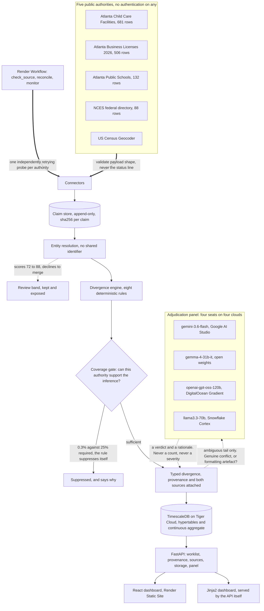

# THROUGHLINE

**A record-integrity layer: it reconciles what one institution asserts about an entity against independent authorities, and reports typed divergence with provenance on every field.**

[](https://github.com/StephenSook/throughline/actions/workflows/ci.yml)
[](./LICENSE)
[](https://throughline-web-gkay.onrender.com)
[](./pyproject.toml)
[](./web)
[](./tests)

Built for **Hack RenderATL**, Atlanta, 12 August 2026.

Atlanta's open data is not a backdrop here. Three City of Atlanta datasets are the engine's input, the divergence they contain is the finding, and the city is where the consequence lands. Render is not a host we deployed to at the end: a Render Workflow fans out one independently retrying probe per authority and then reconciles, which is what turns a one-off audit into continuous monitoring.

## Live demo

| Surface | Where |
|---|---|
| Dashboard | <https://throughline-web-gkay.onrender.com> (React, Render Static Site. Free tier, the first hit may take a moment to warm) |
| API | <https://throughline-api-yo1p.onrender.com> ([`/docs`](https://throughline-api-yo1p.onrender.com/docs), [`/openapi.json`](https://throughline-api-yo1p.onrender.com/openapi.json)) |
| Fallback dashboard | <https://throughline-api-yo1p.onrender.com/> (zero-dependency Jinja2, served by the API itself, so the findings survive the static site being down) |
| Panel seats | <https://throughline-api-yo1p.onrender.com/api/panel> (every seat's provider and endpoint, no credential leaked) |
| Storage proof | <https://throughline-api-yo1p.onrender.com/api/storage> (the hypertables and the continuous aggregate, live) |
| Declined merges | <https://throughline-api-yo1p.onrender.com/api/matches> (what entity resolution refused to merge) |

Open the dashboard and press **Run reconciliation**. It fetches five public registries, resolves entities across them with no shared identifier, and returns a ranked worklist in about six seconds. Click any row to see both source records, the rule that fired, the sha256 of the raw claim, and the panel's votes with dissent shown.

## The problem

Atlanta's public GIS publishes `Atlanta_Child_Care_Facilities`: **681 licensed facilities where children are placed.**

Every row carries its own provenance, and it says this:

```
SOURCE      https://families.decal.ga.gov/provider/data
SOURCEDATE  1634774400000   ->   2021-10-21
```

That is the Georgia state child care licensing registry, snapshotted on **21 October 2021**, and republished as current ever since. Anyone reading it today, a parent, a researcher, a city service, a caseworker, is reading 2021.

Georgia DECAL's own provider API is auth-gated and returns 401. This dataset is the only public view of that registry, it has been frozen for four years and ten months, and nobody had measured what drifted.

The same failure runs through child welfare, which is where this started. A child in foster care exists simultaneously inside five or six institutions: the child welfare agency, the family court, whichever school district they are enrolled in, Medicaid, the placement provider. None of these systems exchange data reliably. The agency's record is treated as the authoritative account of that child's life, and it is frequently wrong. The consequence is not administrative. It is that a child arrives at a new school with no transcript and sits out for weeks, repeats a class they already passed, or misses a prescription because nobody knew about it.

Real child-welfare records are confidential by federal law, so no honest hackathon project can demo on them. **So we did not fake them.** Throughline runs on real public institutional records from the same city, exhibiting the same failure mode, and every number it reports is genuinely computed from live public APIs.

## Throughline in one loop

> Throughline pulls five public registries that describe overlapping sets of real places, stores every assertion as a dated claim with its source URL and a sha256 of the raw record, resolves the same real place across registries that share no identifier, applies eight deterministic rules to find where two authorities contradict each other, measures whether the corroborating authority covers enough of the population to support an inference at all, sends only the genuinely ambiguous tail to four independent models on four different clouds, writes the run into a TimescaleDB hypertable so the rate can be tracked over time, and serves the result as a worklist ranked by consequence rather than by age.

## What it found, on a live run

Every figure below is computed during a reconciliation run against live public APIs. Nothing is hardcoded, [a test enforces that](tests/test_no_fabricated_numbers.py), and every number is regenerated into [`docs/FACTS.json`](docs/FACTS.json) by a real run so the README, the demo narration and the submission all read from one file and cannot drift apart.

| Measure | Value |
|---|---|
| Entities resolved across 5 authorities | **1,344** |
| Claims ingested | **6,385** |
| Divergences detected | **813** |
| Asserted 4.8 years ago, served as current | **658** |
| Published coordinates conflicting with the federal geocode | **69** |
| Addresses the U.S. Census Bureau cannot resolve | **58** |
| ZIP codes two authorities disagree on | **14** |
| Addresses local and federal records disagree on | **10** |
| Records carrying a live identifier and an empty address | **3** |
| Schools one authority calls open and another does not | **1** |
| **Divergence rate** | **51.9%** |
| Full pipeline, five live APIs, wall time | **6.4s** |

Verify any single one of them:

```bash
curl https://throughline-api-yo1p.onrender.com/api/summary
curl 'https://throughline-api-yo1p.onrender.com/api/divergences?limit=5'
curl https://throughline-api-yo1p.onrender.com/api/provenance/<claim_id>
```

## The number we refused to report

The first run produced **1,331** divergences, of which 656 were "listed as OPEN in the state registry, absent from the city's current business licence roll."

That number was wrong, and it was wrong in our favour.

The City of Atlanta's published 2026 licence roll contains **506 records for the entire city**, of which **6** are classified as child day care. A registry of 681 facilities cannot be refuted by a roll that small. Absence from it carries almost no information.

So Throughline now measures the corroborating authority's coverage before drawing any inference from absence. It found the licence roll corroborates **2 of 659** entities, **0.3%**, against a required 25%, so the rule **suppresses itself** and says why: on the dashboard, in the API, and here. That is roughly 650 findings we could have reported and did not.

A tool that inflated its divergence count using a source it never checked the coverage of would be committing the exact failure it exists to detect. The gate is in [`core/diverge.py`](src/throughline/core/diverge.py) and it is tested in both directions.

## One finding, end to end

Found on a live run, and verifiable by anyone in two browser tabs:

| | City of Atlanta GIS | NCES federal directory |
|---|---|---|
| Name | Thomasville Heights Elementary **Facility** | Thomasville Heights Elementary **School** |
| Identifier | `GADOE_ID 5067` (state) | `ncessch 130012000069` (federal) |
| **Operational status** | **`A`**, active | **`2`**, closed |
| Address | 1820 Henry Thomas Dr SE, 30315 | 1820 Henry Thomas Dr SE, 30315 |

Same street address. Neither record carries the other's identifier, so nothing in either system connects them. Throughline matched them on normalized name and address, flagged a `STATUS_CONFLICT`, and all four panel seats returned *genuine* independently.

**What we do and do not claim.** The city record says *Facility* and the federal record says *School*, so it is entirely possible the building is still in active municipal use while the school programme closed. We do not claim Atlanta is unaware a school shut. We claim what the code claims, verbatim from `core/diverge.py`:

> *"Authorities disagree on whether this is operational. A person acting on either record alone would be acting on a contested fact."*

Not a prediction, not a judgement about which authority is right, just the fact that they disagree, surfaced with both sources attached so a human can go and settle it.

## Architecture



What the picture cannot show is the boundary that matters most. The dotted edge into the panel is the only place a model touches this system, and it is the only edge you can delete without changing a single number on any screen. Everything upstream of it is deterministic Python, so every verdict is reproducible by hand from public URLs. The engine modules are forbidden from importing the model layer, and [a test enforces that](tests/test_no_fabricated_numbers.py) rather than a convention.

- `src/throughline/connectors/` fetches the five authorities and validates content, not status codes.
- `src/throughline/core/` holds the parts that are ours: `resolve.py` (entity resolution), `normalize.py` (address normalization), `diverge.py` (the eight rules and the coverage gate), `store.py` (TimescaleDB persistence), `adjudicate.py` (the panel), `pipeline.py` (one run, shared by the API, the CLI and the Workflow so they cannot drift).
- `web/src/components/` is the React dashboard: `Worklist`, `DetailPanel`, `ProvenanceCard`, `AdjudicationVotes`, `CoveragePanel`, `HistoryBand`, `StatTiles`.
- `workflow.py` registers three Render Workflow tasks: `check_source`, `reconcile`, `monitor`.

## What is real

| Component | Status | What it is |
|---|---|---|
| Five public connectors | **WIRED LIVE** | No authentication on any. Reproducible by a stranger from the URLs below |
| Entity resolution | **WIRED LIVE** | `core/resolve.py`, accept above 88, refuse below 72, review band between |
| Eight divergence rules | **WIRED LIVE** | `core/diverge.py`, deterministic, seven kinds observed on the current run |
| Coverage gate | **WIRED LIVE** | Suppressing its own largest rule right now, visible at `/api/summary` |
| TimescaleDB on Tiger Cloud | **WIRED LIVE** | 2.29.1, two hypertables, `divergence_rate_hourly` continuous aggregate, compression on closed chunks. Proof at `/api/storage` |
| Render Workflow | **WIRED LIVE** | `workflow.py`, three registered tasks, fan-out with per-task retry |
| Four-seat panel | **WIRED LIVE** | All four seats configured and returning verdicts. Proof at `/api/panel` |
| React dashboard | **WIRED LIVE** | Render Static Site, reading the live API |

Planned and deliberately not shipped: a scheduled Workflow trigger, and the 2025 licence roll for a year-over-year series. Neither is claimed above.

## Where the models are used

Only on the ambiguous tail, and only to answer one question: is this discrepancy a genuine conflict, or an artefact of formatting? Every vote is stored and displayed with its rationale, dissent included.

| Seat | Model | Provider | Why it is there |
|---|---|---|---|
| 1 | `gemini-3.6-flash` | Google AI Studio | Hosted frontier model, strong general judgement |
| 2 | `gemma-4-31b-it` | Google AI Studio, open weights | An agency that cannot send record data to a third-party cloud can run this on its own hardware, so the on-premises path is not a downgrade to nothing |
| 3 | `openai-gpt-oss-120b` | DigitalOcean Gradient, open weights | A different vendor on different infrastructure, so one provider's outage degrades the panel instead of ending it |
| 4 | `llama3.3-70b` | Snowflake Cortex, warehouse-native | An agency whose records already live in Snowflake can adjudicate without the data crossing its own warehouse boundary |

Two voters can only agree or deadlock. Four produce a majority with a visible minority. Seats are built from whichever credentials are present and the count is reported, so a two-seat run is visibly a two-seat run, and a seat that fails to answer is recorded as an error and never counted as agreement. We saw exactly that in production when DigitalOcean returned 402 on exhausted trial credits.

**The models never produce a number.** They do not count, do not set severity, and do not decide that a divergence exists.

## Tech stack

| | |
|---|---|
| Backend | Python 3.11, FastAPI, httpx, asyncio, asyncpg |
| Entity resolution | rapidfuzz, custom USPS-style normalizer |
| Models | Gemini 3.6 Flash, Gemma 4 31B (Google AI Studio), GPT-OSS-120B (DigitalOcean Gradient), Llama 3.3 70B (Snowflake Cortex, SQL API v2, keypair JWT) |
| History | TimescaleDB 2.29.1 on Tiger Cloud, hypertables, continuous aggregate, compression |
| Orchestration | Render Workflows, fan-out probes with per-task retry, then reconcile |
| Deploy | Render web service and static site |
| Dashboard | React 18, TypeScript, Tailwind, TanStack Query, plus a zero-dependency Jinja2 dashboard served by the API itself |
| CI | GitHub Actions: ruff, ruff format, 69 tests, an anti-fabrication guard, and a prose guard |

## Data sources

| Source | Authority | Rows | Endpoint |
|---|---|---|---|
| Child Care Facilities | City of Atlanta, republishing Georgia DECAL | 681 | [ArcGIS FeatureServer](https://services5.arcgis.com/5RxyIIJ9boPdptdo/ArcGIS/rest/services/Atlanta_Child_Care_Facilities/FeatureServer/6/query?where=1%3D1&outFields=*&f=json) |
| Business Licenses 2026 | City of Atlanta, Dept. of Revenue | 506 | [ArcGIS FeatureServer](https://services5.arcgis.com/5RxyIIJ9boPdptdo/ArcGIS/rest/services/Business_Licenses_2026/FeatureServer/50/query?where=1%3D1&outFields=*&f=json) |
| Public Schools | City of Atlanta / APS | 132 | [ArcGIS FeatureServer](https://services5.arcgis.com/5RxyIIJ9boPdptdo/ArcGIS/rest/services/Atlanta_Public_Schools/FeatureServer/0/query?where=1%3D1&outFields=*&f=json) |
| School directory | U.S. Dept. of Education (NCES CCD), via Urban Institute | 88 | [Education Data API](https://educationdata.urban.org/api/v1/schools/ccd/directory/2022/?leaid=1300120) |
| Geocoder | U.S. Census Bureau | 1,384 addresses geocoded | [Public_AR_Current](https://geocoding.geo.census.gov/geocoder/locations/addressbatch) |

## Repo layout

```
src/throughline/
  connectors/     five public authorities, content validation, not status codes
  core/           resolve, normalize, diverge, store, adjudicate, pipeline, models
  api/            FastAPI app, provenance endpoints, Jinja2 fallback dashboard
web/src/          React dashboard, components and typed API client
tests/            69 tests, including the anti-fabrication guard
scripts/          prose guard, run with --check in CI
workflow.py       Render Workflow: check_source, reconcile, monitor
schema.sql        hypertables, continuous aggregate, compression policy
docs/FACTS.json   the one fact ledger every artifact reads from
```

## Quickstart

```bash
git clone https://github.com/StephenSook/throughline
cd throughline
uv sync --extra dev
uv run pytest -q                      # 69 tests
uv run uvicorn throughline.api.main:app --reload
open http://localhost:8000
```

No API key is required to run the engine. Every source is public and unauthenticated. `GEMINI_API_KEY` (from [AI Studio](https://aistudio.google.com/apikey)) enables the adjudication panel, and without it the panel reports that it is disabled while every deterministic verdict is unaffected. See [`.env.example`](.env.example).

## Verification

The claim worth checking hardest is the one most often asserted and least often enforced: that the numbers are computed rather than written down. Check it in one command, with no network and no credentials:

```bash
uv run pytest tests/test_no_fabricated_numbers.py -v
```

That suite asserts the engine modules cannot import the model layer, that no divergence count is a literal in source, and it includes a non-vacuity check, so a bug that made the guard scan nothing would fail rather than pass quietly. CI runs it on a bare exit path with no pipe, because a pipeline reports its last command's status and a failing suite can otherwise merge green. CI additionally asserts the guard actually collected tests and skipped none, because a conditionally skipped guard is a false green.

## Honesty and limitations

- Throughline reports that two authorities disagree. It does not determine which one is right, and it never claims a facility is closed, unlicensed, or unsafe.
- The 51.9% divergence rate is a rate for this population of Atlanta records under these eight rules. It is not a general claim about public data.
- The largest rule we wrote is switched off in production by our own coverage gate. The rate would be far higher if we counted absence, and counting it would have been wrong.
- Entity resolution is probabilistic. Matches between 72 and 88 are recorded and refused rather than guessed, and unmatched records are kept rather than dropped, because dropping them would flatter the rate.
- No child-welfare data is used, touched, or simulated anywhere in this project. The child-welfare framing is the motivation, and the Atlanta public records are the evidence.

Enforced in the code, not just stated here:

- **No predictive risk scoring.** Prediction from a broken record is the problem, not the fix.
- **No case management.** We never compete with the systems that feed us. Neutrality is the point.
- **No automated decision affecting a child's placement or a parent's rights.** Throughline surfaces discrepancies. Humans decide. Always.

## Team

**Stephen Sookra**: connectors, entity resolution, divergence engine, coverage gate, adjudication panel, TimescaleDB, Render Workflow, API, deploy, CI.
**Khadim Drame**: React dashboard: grouped worklist, divergence detail, provenance card, adjudication votes, coverage panel, history band.

## License

MIT. See [LICENSE](./LICENSE).
